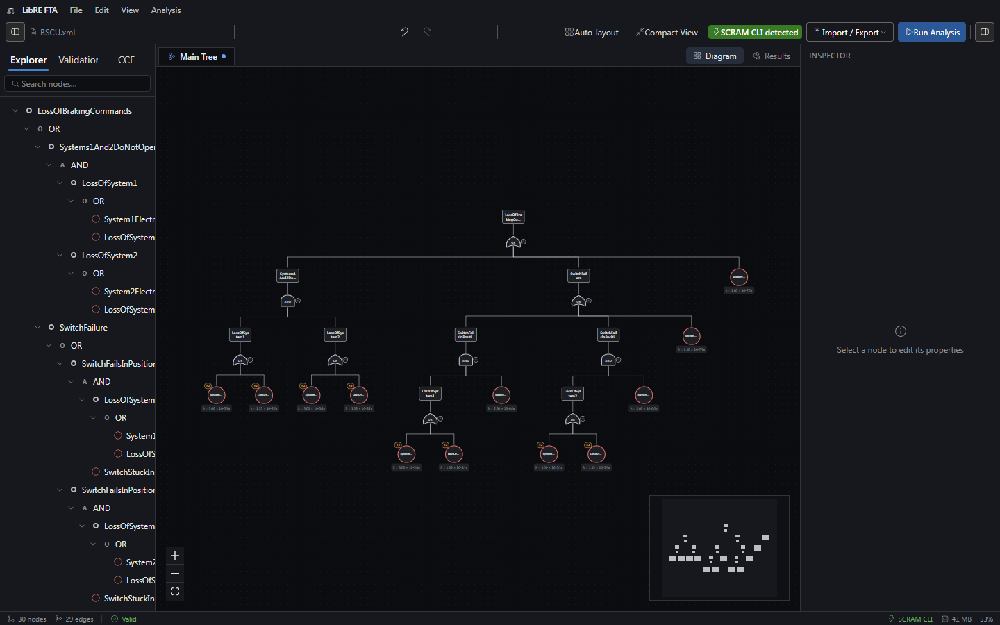
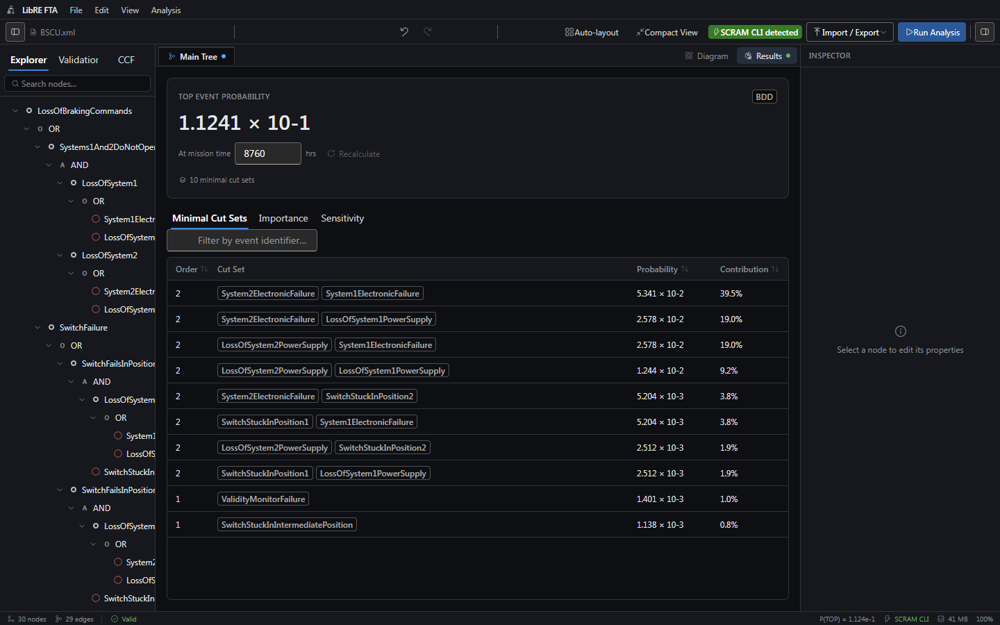
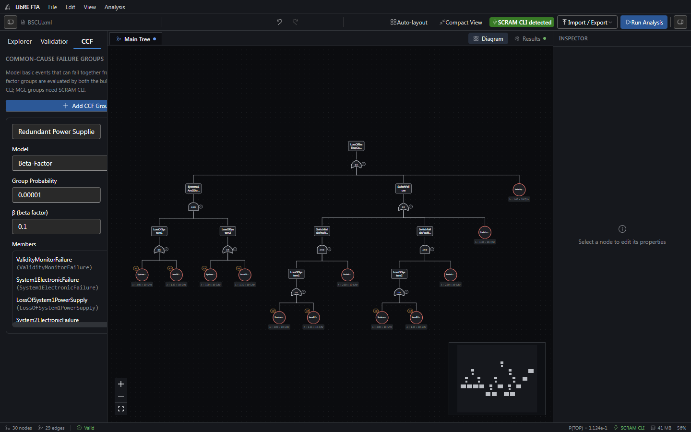

<p align="center">
  
</p>

<h1 align="center">LibRE FTA — Free Fault Tree Analysis Software (GUI for SCRAM)</h1>

<p align="center">
  <strong>An open-source desktop fault tree analysis (FTA) editor and graphical user interface for the SCRAM PRA engine.</strong><br />
  Build fault trees visually, validate them in real time, and run qualitative and quantitative
  probabilistic risk assessment (PRA) / reliability analysis powered by the real
  <a href="https://scram-pra.org/">SCRAM</a> engine — with full Open-PSA Model
  Exchange Format (MEF) import/export for interoperability with other PRA and reliability engineering tools.
</p>

<p align="center">
  <em>Keywords: fault tree analysis software, FTA tool, SCRAM GUI, SCRAM front-end, probabilistic risk assessment software,
  PRA software, Open-PSA MEF editor, minimal cut set calculator, reliability engineering software, free FTA editor,
  open-source fault tree software, common-cause failure (CCF) analysis tool, cross-platform FTA app for Windows macOS Linux.</em>
</p>

<p align="center">
  
  
  
  
</p>
<p align="center">
  
  
  
  
  <a href="https://doi.org/10.5281/zenodo.22039061"></a>
</p>

## What is LibRE FTA?

**LibRE FTA is a free, open-source graphical user interface (GUI) for [SCRAM](https://scram-pra.org/)**,
the command-line probabilistic risk assessment (PRA) engine. If you've been searching for a
**SCRAM GUI**, a **visual fault tree editor**, or **free fault tree analysis software** that produces
exact BDD/ZBDD-based results instead of a spreadsheet approximation, this is that tool. It's built for
reliability engineers, safety engineers, and risk analysts who need to draw fault trees on a canvas,
compute minimal cut sets, and get importance/sensitivity results without hand-writing Open-PSA MEF XML
or driving SCRAM from the command line.

## Why use LibRE FTA instead of the SCRAM command line?

- 🖱️ **Visual fault tree editor** — drag-and-drop gates and basic events on an interactive canvas instead of hand-authoring XML.
- ✅ **Live model validation** — catch malformed fault trees before you run an analysis.
- 🎯 **Real SCRAM results** — when running as a desktop app, it shells out to the actual SCRAM CLI for exact BDD/ZBDD-based cut sets, not an approximation.
- 🌐 **Browser fallback** — a built-in JavaScript fault-tree engine means you can try it instantly at `localhost`, no SCRAM install required.
- 🔗 **Open-PSA MEF import/export** — interoperate with other PRA tools that speak the Open-PSA Model Exchange Format standard.
- 🔧 **Common-cause failure (CCF) groups** — model dependent failures, not just independent basic events.
- 📊 **Built-in results dashboards** — minimal cut set tables, importance measures, and sensitivity charts out of the box.
- 💻 **Cross-platform** — native desktop builds for Windows, macOS, and Linux via Tauri.
- 🆓 **Free and open source (MIT)** — no license fees, no vendor lock-in.

## Screenshots

| Diagram | Results |
|---|---|
|  |  |

<details>
<summary><strong>🔗 Common-cause failure (CCF) groups</strong></summary>
<br />



</details>

## ✨ Tech stack

| Layer | Tech |
|---|---|
| 🖥️ Shell | Tauri v2 (Rust) |
| ⚛️ Frontend | React 19 + TypeScript, Vite |
| 🎨 Canvas | `@xyflow/react`, a from-scratch bottom-up tree layout (`src/lib/layout/elkLayout.ts`) |
| 🗃️ State | Zustand + Immer, undo/redo via `zundo` |
| 💅 UI | Tailwind CSS v4, Fluent UI, shadcn-style components |
| 📄 Data | `fast-xml-parser` + `zod` (Open-PSA MEF), `@tanstack/react-table`, Recharts |

## 🚀 Getting started

```bash
npm install
npm run dev             # browser-only preview at http://localhost:1420
npm run tauri dev       # full desktop app (requires the Rust toolchain)
npm run build:portable  # Windows: a no-installer, no-admin portable .exe (see below)
```

### 📦 Portable build (Windows)

`npm run build:portable` builds a release binary and zips it up with
everything it needs next to it — `WebView2Loader.dll` and the bundled SCRAM
CLI's `resources/` folder — into `dist-portable/LibRE-FTA-portable-win64.zip`.
Extract it anywhere (a folder, a USB stick) and run `LibRE FTA.exe` directly;
no installer, no admin rights, no separate SCRAM setup. Under the hood it's
just `tauri build --no-bundle` (skips the MSI/NSIS installer step) followed
by [`scripts/package-portable.ps1`](scripts/package-portable.ps1), which does
the copying/zipping.

The app works standalone in a browser using a built-in JS fault-tree analysis
engine (`src/lib/analysis/engine.ts`, run off the main thread in a Web Worker).
When run inside the Tauri shell **and** a real SCRAM binary is available (see
below), it shells out to the real engine instead
(`src-tauri/src/lib.rs`, `src/lib/scram/runner.ts`) for exact BDD/ZBDD-based
results, parsing its XML report (`src/lib/scram/reportParser.ts` — verified
against real SCRAM output, see [CHECKS_REPORT.md](docs/checks-report.md)).

## 🔍 Pointing the app at SCRAM

### 🪟 Windows — already done for you

The desktop build **ships a real, working SCRAM CLI inside the app itself**
(`resources/scram/`, ~11 MB — the binary plus its full runtime DLL closure and
schema files) and uses it automatically, with zero setup: no download, no
install, no PATH entry. It's checked before anything else, so the app runs
against the real BDD/ZBDD engine from the very first launch. Nothing below
this is required on Windows unless you specifically want a *different* SCRAM
build (a newer version, a custom compile flag, etc.).

### 🐧 macOS / Linux — build SCRAM once, point the app at it

No bundled binary ships for macOS/Linux yet, so SCRAM needs to be built from
source once — after that, the app finds and validates it automatically.
SCRAM's source and full build docs live at
**[github.com/rakhimov/scram](https://github.com/rakhimov/scram)**.

```bash
# 1. Install build dependencies (Ubuntu/Debian shown; see the SCRAM repo's
#    README for macOS/other distros):
sudo apt-get install -y cmake libboost-all-dev libxml2-dev

# 2. Clone and build
git clone --recursive https://github.com/rakhimov/scram.git
cd scram
mkdir build && cd build
cmake .. -DCMAKE_BUILD_TYPE=Release
make -j$(nproc)

# 3. Install it (this is the step people most often skip — see below)
sudo make install
```

That last `make install` step matters: it's what copies SCRAM's schema files
(`share/scram/*.rng`) next to the binary where it expects to find them. Skip
it and you'll have a binary that runs `--version` fine but fails every real
analysis — this app **detects and auto-repairs exactly that case** (see
below), but running the install step yourself avoids it entirely.

### Pointing the app at a SCRAM install

Click the **SCRAM CLI detected** / **Built-in engine** badge in the status bar
(or toolbar) to open the location picker.

- **Already on `PATH`** (e.g. `sudo make install`'s default prefix, a package
  manager, or `mingw64`'s `scram` package on Windows): used automatically if
  no bundled binary is found.
- **Not on `PATH`**: click **Browse for Folder…** and point it at:
  - the folder containing the `scram`/`scram-cli` binary directly, **or**
  - the SCRAM source checkout you just cloned/built (or downloaded as a
    zip and extracted) — the picker searches a few levels down for the built
    binary (typically `build/bin/scram`), validates it by actually running
    `scram --validate` against a tiny embedded model (not just `--version`,
    which can't tell a broken install from a working one), and — this is the
    "plug and play" part — if that binary was built but never `make install`ed
    (so it's missing its paired schema files), the app finds the real schema
    files still sitting in the source tree's own `share/` folder and copies
    them into place automatically before trying again. Note this only helps
    once a binary actually exists (i.e. after step 2 above) — pointing the
    picker at a bare, unbuilt clone or a freshly-extracted zip has nothing to
    find yet, since building SCRAM from C++ source can't be skipped.
  - The whole search is bounded (skips VCS/build-cache directories, hard
    8-second time limit) so pointing it at the wrong folder — even a large,
    unrelated project — resolves quickly instead of hanging.
- **Auto-detect** button re-runs the bundled → `PATH` search at any time, e.g.
  after installing SCRAM while the app was already open.

See [SCRAM CLI integration](docs/documentation/scram-cli-integration.md) for the full
technical detail, and [CHECKS_REPORT.md](docs/checks-report.md) for what's been
verified against a real broken-install checkout.

## ❓ Frequently asked questions

**Is LibRE FTA the same as SCRAM?**
No. [SCRAM](https://scram-pra.org/) is the underlying PRA/FTA calculation
engine (a command-line tool). LibRE FTA is a separate, independent desktop
application that provides a graphical fault tree editor and drives SCRAM
as a subprocess to get exact results — in other words, LibRE FTA is a **GUI
for SCRAM**, not a fork or reimplementation of it.

**Do I need SCRAM installed to use LibRE FTA?**
No. LibRE FTA includes a built-in JavaScript fault-tree analysis engine that
works standalone in a browser or desktop app with zero setup. Connecting a
real SCRAM binary upgrades you from that approximation to exact BDD/ZBDD-based
results.

**What file formats does LibRE FTA support?**
LibRE FTA reads and writes the **Open-PSA Model Exchange Format (MEF)**, an
open XML standard for fault trees, so models are portable to and from other
PRA and reliability engineering tools.

**Is LibRE FTA free?**
Yes — LibRE FTA's own code is MIT licensed. The bundled SCRAM CLI is a
separate program under its own authors' GPLv3 license, invoked as a
subprocess.

## 📚 Documentation

- **[Documentation](docs/documentation.md)** — the full reference: every feature,
  current limitations, and what has/hasn't been tested.
- **[CHECKS_REPORT.md](docs/checks-report.md)** — results of the most recent
  verification pass against real SCRAM benchmark models.

## 🗂️ Project layout

```
src/
  components/
    canvas/       gate & event nodes, palette, the XYFlow canvas
    panels/       inspector, validation (lint), CCF groups, tree view
    results/      top event readout, minimal cut set table, importance/sensitivity charts
    toolbar/      run dialog, undo/redo, import/export, theme
    ui/           shadcn-style primitives
  lib/
    analysis/     built-in cut-set / probability / importance engine (runs in a Web Worker)
    openpsa/      Open-PSA MEF XML parser + serializer (+ zod schema)
    scram/        SCRAM CLI invocation & report parsing
    layout/       fault-tree auto-layout
    validation/   live model linting
    export/       PNG/SVG diagram export, PDF/XML report export
    io/           file open/save, crash-recovery autosave
  store/
    ftaStore.ts   canvas + model state (nodes/edges/results/run options/document identity)
src-tauri/        Rust shell: SCRAM process invocation, file dialogs, fs access, window control
```

## 📝 Notes

- Building the actual Tauri desktop binary requires the Rust toolchain
  (`rustup`) in addition to Node. `npm run build && npm run tauri build`.
- Every native OS dialog (file open/save, SCRAM binary picker) and the
  window-close interception require explicit capability grants in
  `src-tauri/capabilities/default.json` — see
  [architecture notes](docs/documentation/architecture-notes.md).

## 🐛 Found a bug?

Please [open an issue](https://github.com/A-K-T-K/libre-fta/issues) —
include what you did, what happened, and what you expected. For a crash or a
SCRAM-related problem, the app's status bar/console output is helpful context
to paste in too.

## ⚖️ License

LibRE FTA's own source code is [MIT licensed](LICENSE). The bundled
[SCRAM](https://github.com/rakhimov/scram) CLI (`src-tauri/resources/scram/`)
is a separate program under its own authors' GPLv3 license — see
[`LICENSE-SCRAM`](src-tauri/resources/scram/LICENSE-SCRAM) — invoked as a
subprocess, not linked into this app's code.

## 📖 Citation

If you use LibRE FTA in your work, please cite it — see
[`CITATION.cff`](CITATION.cff) (GitHub's "Cite this repository" button on the
repo sidebar reads this automatically), or cite the archived release
directly via its DOI: [10.5281/zenodo.22039061](https://doi.org/10.5281/zenodo.22039061).

---

<p align="center"><sub>
LibRE FTA — free open-source fault tree analysis (FTA) software · SCRAM GUI · probabilistic risk assessment (PRA) tool ·
Open-PSA MEF editor · minimal cut set & importance analysis · reliability engineering software for Windows, macOS, and Linux.
</sub></p>
